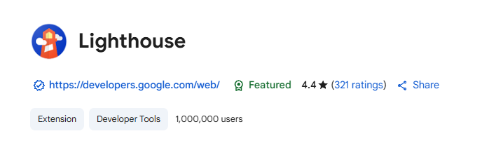
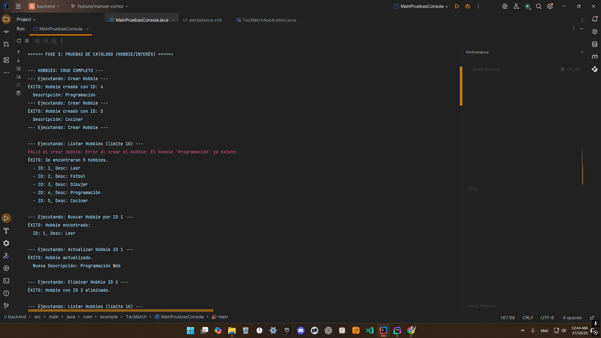
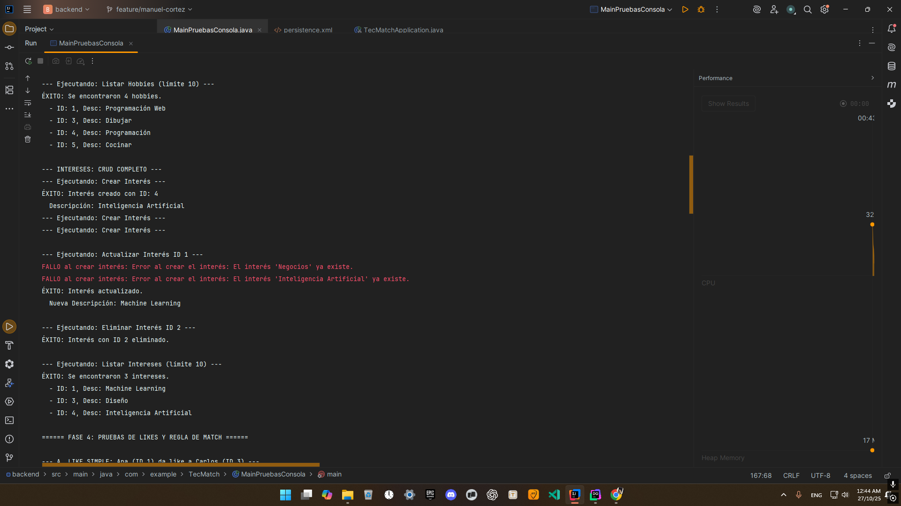
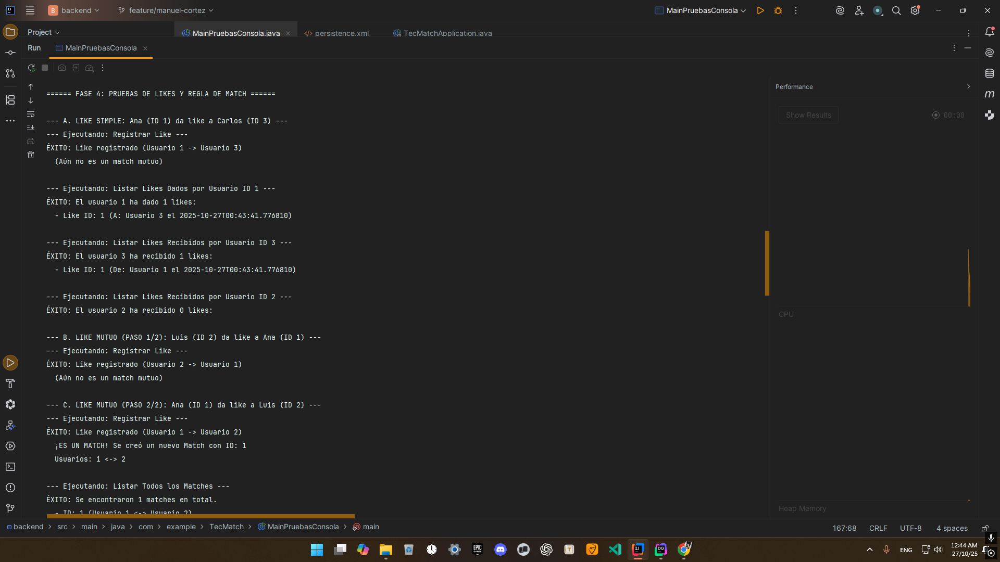
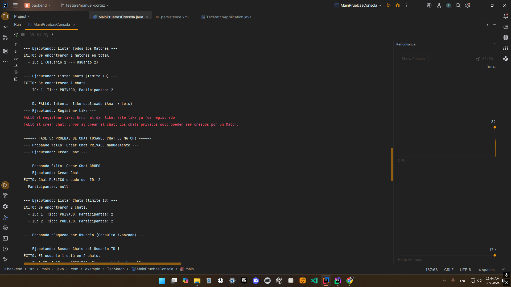
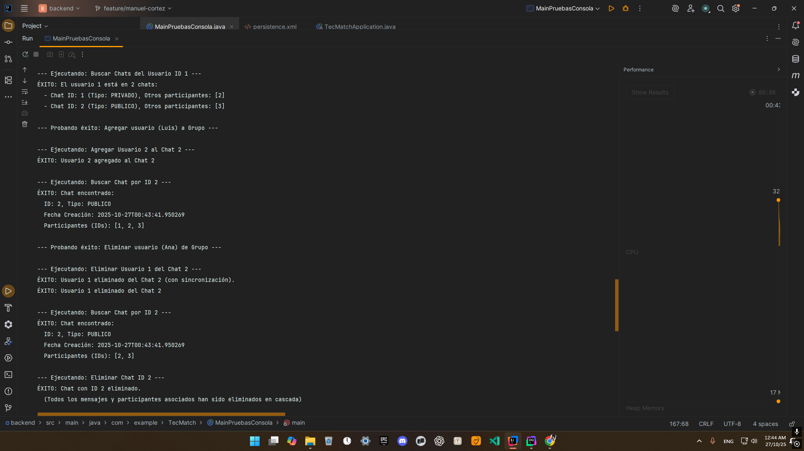
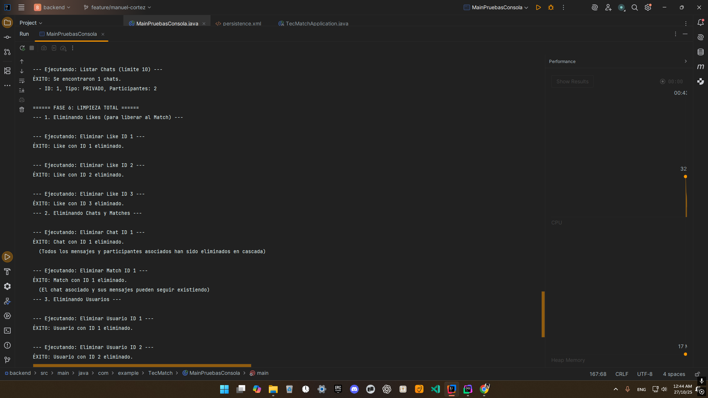
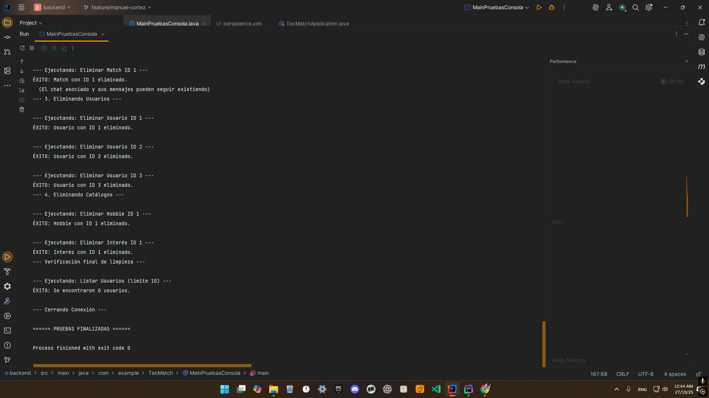

# Potro-NET: Red Social para Estudiantes de ITSON

Proyecto desarrollado en la materia de **Base de Datos Avanzadas**, bajo la coordinación del docente **Martín Guadalupe Bernal Lugo**. Este proyecto está enfocado en desarrollar una red social exclusiva para estudiantes de nuestra institución, accesible únicamente a través del **Correo Institucional**.

## Diagrama de Distribución de Arquitectura

Para el despliegue de la **Web App** se utilizó una infraestructura distribuida, la cual se detalla en el siguiente diagrama, incluyendo el flujo de trabajo utilizado durante el desarrollo:


---

### **Google Search Console**

- El sistema está **indexado en Google Search Console**, lo que permite aparecer en la **primera página de resultados** al buscar `Potro Net` o `Potro-Net`.

### **Vercel**

- El **Frontend** está desplegado en **Vercel** y vinculado a un **repositorio de GitHub**, asegurando actualizaciones automáticas y control de versiones.

### **Frontend**

- Desarrollado con **React + TypeScript**, utilizando la librería de componentes **Material-Tailwind**.
- Totalmente adaptado con **Tailwind CSS**, garantizando un diseño responsivo y moderno.

### **API Rest**

- El **Backend** está construido con **Java Spring Boot**.
- Para la conexión y gestión de la base de datos se utiliza **JPA** con una **base de datos MySQL remota**.
- La **API** está desplegada en **Render**, lo que permite acceso externo seguro y confiable.

### **Imágenes**

- Para la **carga de imágenes** se emplea un **servicio externo** como **Cloudinary**, que facilita la persistencia de imágenes y su acceso mediante URLs.

### **Base de Datos**

- La aplicación requiere una **base de datos externa** para su despliegue. Se utiliza **Aiven**, un servicio gratuito con espacio limitado, que permite manejar una base de datos **MySQL remota**.
- Limitación: Aiven no ofrece interfaz gráfica; se requiere **conexión SSL desde un IDE** para manipular la base de datos directamente.

### **GitHub**

- Se cuenta con un **repositorio principal**, donde se desarrolla todo utilizando una **variación del flujo Git Flow**.
- Además, existe un **fork** del repositorio principal para el despliegue, lo que genera una **barrera de sincronización**, permitiendo que los cambios se reflejen únicamente al sincronizar manualmente el fork.

---

## **Estadísticas de Rendimiento**

Para evaluar la aplicación se utilizó **LightHouse**, una extensión de navegador que analiza distintos aspectos de la página: **optimización, tiempos de carga, buenas prácticas y posicionamiento SEO**.

<div align="center">



<div align="left">

## **Resultados**

Los resultados obtenidos reflejan un desempeño sólido, aunque la **carga de la página** puede mejorar debido a que algunas dependencias cargan **CSS innecesario**.

<div align="center">


# ENTREGA 2

<div align="left">

## Instrucciones de Uso

Nuestro proyecto esta desarrollado como una API Rest para toda la parte de Java debido a que el front se esta desarrollando con React + TS, por lo que para este entregable desarrollamos tanto la parte de la API que sera conectada con el front, como los controllers convencionales para pruebas.

Cabe recalcar que si prefiere hacer las peticiones desde la api tendra que usar Postman para hacer las solicitudes.

### Requisitos

- Version Compilacion JDK 21
- Archivo de configuarcion local para Springboot

### Descarga del Repositorio

Puede clonar el repositorio desde su terminal con la url del repositorio o mismamente en GitHub Desktop

```terminal
git clone https://github.com/SebastianEsc05/TecMatch-API
```

## Archivo Configuracion Local

Para correrlo con Springboot debera crear el siguiente archivo con el nombre `application-local.properties`

```properties
spring.datasource.username=**Su usuario SQL**
spring.datasource.password=**Su contraseña SQL**
jwt.jwt.secret=TWVQdXNlTGFHdWNjaUNvblVuU2hvcnREZU5pa2VCdXpvQ2FkZW5hRXN0b3lRdWVHb3Rlb1NpZ29Wb2xhbmRvQ2l1ZGFkRW5DaXVkYWRUdW1iYW5kb0VsQ2x1YlNob3V0T3V0UGFyYU5lbw==
```

El archivo debe pegarse en la siguiente ruta:

```path
src/main/resources/
```

Cabe recalcar que las funcionalidades de email aun no estan disponibles con esta configuracion y simplemente esta limitada al los requisitos para este entregable.

## Inserts

- Para probar los inserts debe contar con un esquema creado en su localhost:3306
  con el nombre `TecMatch`

- Al correr la clase `Main` podra insertar las distintas entidades solicitadas en el documento

## Pruebas

- El proyecto tambien cuenta con algunas de pruebas integardas en la clase `Main`, en las que las que se muestran las distintas funcionalidades solicitadas.

- Para que todo funcione es necesario correr el script de los SP en la base de datos, el script se encuentra en la raiz del repositorio. `usuariosSPcreator.sql`

## Capturas de los Resultados de Ejecucion

**Nota:** Los errores en rojo tambien son pruebas.

      
